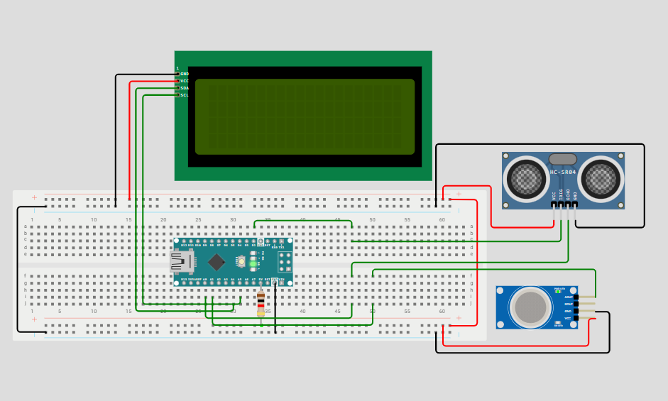

# Arduino LCD Display 4x20

## Description
Learn Project. This project made for learn how to use LCD Display with arduino board.
## Component List
```
1. Arduino Nano
2. LCD Display 4x20
3. Ultrasonic Sensor (4 pin)
4. Gas Sensor
```

## Project Link
```
Wokwi: https://wokwi.com/projects/424685479033659393
```

## Social link
https://www.instagram.com/p/DG3L99Mz5yx/?utm_source=ig_web_copy_link&igsh=MzRlODBiNWFlZA==
<blockquote class="twitter-tweet"><p lang="en" dir="ltr">Project: LCD Display 4x20<br>Author: <a href="https://twitter.com/nhatbeo09sd?ref_src=twsrc%5Etfw">@nhatbeo09sd</a> <br>This project made for learn how to use LCD display.<br>The code, instruction and circuit all in link below:<br>Link Wokwi: <a href="https://t.co/1eFg2BymiD">https://t.co/1eFg2BymiD</a><br>Link Github: <a href="https://t.co/oc47WDkBPO">https://t.co/oc47WDkBPO</a> <a href="https://t.co/kXJEGCxlBH">pic.twitter.com/kXJEGCxlBH</a></p>&mdash; Arduino Project (@ArduinoP60991) <a href="https://twitter.com/ArduinoP60991/status/1900872333348466770?ref_src=twsrc%5Etfw">March 15, 2025</a></blockquote> <script async src="https://platform.twitter.com/widgets.js" charset="utf-8"></script>

## Circuit Image

